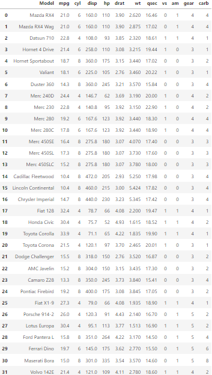
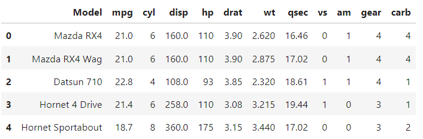
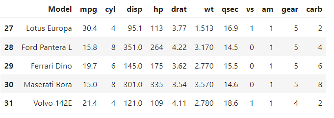
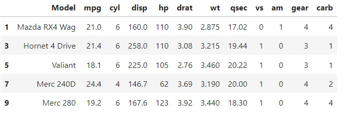
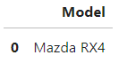
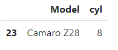
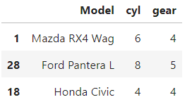

# EXPERIMENT 3 - Python Data Analysis
### Problem:
P1:
* How to load the corresponding .csv file (cars.csv) into a data frame named cars using pandas.
* How to display the first five and last five rows of the resulting cars.

P2:

Using the similar .csv file:
* How to display the first five rows with odd-numbered columns of cars.
* How to display the row that contains the "Model' of 'Mazda RX4'.
* Determine how many cylinders ('cyl') does the car model 'Camaro Z28' have.
* Determine how many cylinders ('cyl') and what gear type ('gear') do the car models 'Mazda RX4 Wag', 'Ford Pantera L' and 'Honda Civic' have.
  
## Background
#### Python Data Analysis (Pandas) 
The Pandas library is built on NumPy and provides easy-to-use data structures and data analysis tools for Python programming language.

## How to solve the problem using Pandas?
* To begin with, you must learn and identify the codes and functions incorporated in the Pandas library.
* I used Anaconda Navigator that has Jupyter Notebook pre-installed which I used for coding.

## For P1:
#### A. How to load the corresponding .csv file (cars.csv) into a data frame named cars using pandas?
1. Download the corresponding file named "cars.csv".
2. Create a jupyter notebook that has the same file location with the downloaded csv file.
3. Start the coding by assessing the Pandas library: 'import pandas as np'
4. Use the read function for csv files that will read and load the data in the DataFrame.

#### B. Dislay the first and last five rows of the resulting cars.
1. With the use of .head() and .tail() function, display the first and last five rows of the given cars in the data.

#### How to save the file as Surname_Pandas-P1.py:
1. Click on File.
2. Select on Save and Export Notebook As.
3. Select Executable Script.

## For P2:
* Start the coding by assessing the Pandas library: 'import pandas as np'
* Load the similar .csv file from P1.
  
#### A. How to display the first five rows with odd-numbered columns of cars.
1. Using the .iloc function and slicing, select the every second row from index 1.

#### B. How to display the row that contains the 'Model' of 'Mazda RX4'.
1. Using the .loc function, input the car model 'Mazda RX4' and return the 'Model' value only.

#### C. Determine how many cylinders ('cyl') does the car model 'Camaro Z28' have.
1. Using the .loc function, input the row where 'Camaro Z28' belongs and return 'Model' and 'cyl' values only.

#### D. Determine how many cylinders ('cyl') and what gear type ('gear') do the car models 'Mazda RX4 Wag', 'Ford Pantera L' and 'Honda Civic' have.
1. Using the .loc function, input the row of car models 'Mazda RX4 Wag', 'Ford Pantera L', and 'Honda Civic' and return the 'cyl' and 'gear' values only.

#### How to save the file as Surname_Pandas-P2.py:
1. Click on File.
2. Select on Save and Export Notebook As.
3. Select Executable Script.

## Output

This is my output for loading the corresponding .csv file (cars.csv) into a data frame named cars using pandas.
***

This is my output for displaying the first five rows of the resulting cars from the data frame.
***

This is my output for displaying the last five rows of the resulting cars from the data frame.
***

This is my output for displaying the first five rows with odd-numbered columns of cars.
***

This is my output for the displaying the row that contains the 'Model' of 'Mazda RX4'.
***

This is my output for determining how many cylinders does the car model 'Camaro Z28' have.
***

This is my output for determining how many cylinders and what gear type do the car models 'Mazda RX4 Wag', 'Ford Pantera L' and 'Honda Civic' have.
***
## Author
Pangan, Raven G.

## References
* ECE2112 Lecture Notes by Prof. Engr. Ma. Madecheen S. Pangaliman, MSc, and Prof. Engr. Nico John Leo S. Lobos.
* README.md file by SuperMadee 

